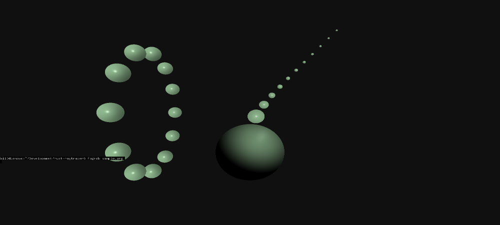

# rust-raytracer

Weekend Project: A simple, crude Raytracer for Linux.
Inspired by the helpful lessons from [https://github.com/ssloy](https://github.com/ssloy)
It features a single point-source of light illuminating solid spheres (with specular highlights).
Moving the renderer into a loop this software product achieves an impressive 0.3 FPS with approximately 20 entities at 1080p.

## Compile and Run

`cargo build` ; `cargo run`

## Important note

This code writes directly to the frame buffer `/dev/fb0`.
If you have and windowing system like Gnome running it will inhibit this code from rendering to the screen.
On Ubuntu, simply use Ctrl+Alt+F3 (for example) to drop out of Gnome and into a terminal session.

## Open questions
Opening up a memory map to `/dev/fb0` will substantially increase performance.
However, I've struggled to find a clean, simple method to create this map in Rust.
I'd like to avoid 0.0.x-versioned crates or any potentially bloated external dependency.
